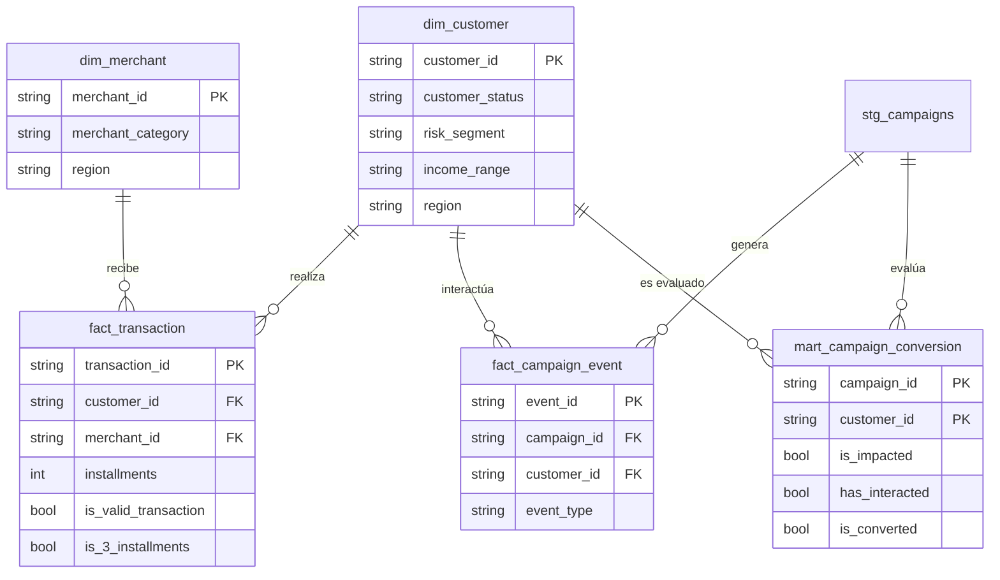

# Capa analítica — Campaña "3 cuotas sin interés" (3CSI)

[](https://github.com/cristobal-ui/Challenge-Ingeniero-Modelado-de-Datos/actions/workflows/ci.yml)

Modelo de datos simple, confiable y documentado para que **Producto y Marketing**
midan, de forma autónoma, el **impacto, la interacción y la conversión** de la
campaña `CMP2026053CSI` (3 cuotas sin interés, mayo 2026).

La solución es un **proyecto dbt** (dbt-duckdb) organizado por capas
(`staging` → `marts`), ejecutable localmente con **DuckDB** y **pensada para
BigQuery** en producción. No requiere GCP.

### ✅ Comando validado (y su salida esperada)

| Comando | Salida esperada |
|---|---|
| `pip install -r requirements.txt && cd dbt && dbt build --profiles-dir .` | `Done. PASS=40 WARN=3 ERROR=0` (los 3 WARN = huérfanos controlados); **320 impactados, 171 convertidos, 53.44%** |

> Se ejecuta en CI en cada push (ver
> [`.github/workflows/ci.yml`](.github/workflows/ci.yml)).

---

## 1. Cómo ejecutar / revisar la solución

**Requisito:** Python 3.9+ y `dbt-duckdb==1.10.1` (única dependencia). No requiere GCP.

```bash
pip install -r requirements.txt      # dbt-duckdb==1.10.1 (versión validada)
cd dbt
dbt build --profiles-dir .           # construye modelos desde los CSV + corre tests
```

`dbt build` construye las capas en orden de dependencias (resuelto por el DAG de
`ref()`/`source()`), materializa los marts y ejecuta **todos los tests** en una
sola corrida. Los CSV crudos se leen como *external sources* desde
[`data/`](data/); no hay que cargar nada a mano.

Resultado esperado: `PASS=40 WARN=3 ERROR=0`. Los 3 WARN son las claves
huérfanas controladas (integridad referencial con `severity: warn`): el modelo
las **detecta sin romper** el pipeline. Detalle en [`dbt/README.md`](dbt/README.md).

```bash
# Reapuntar el análisis a otra campaña (parametrizable, sin tocar SQL)
dbt build --profiles-dir . --vars 'target_campaign_id: CMP202604CASHBACK'

# (Opcional) documentación y linaje navegable
dbt docs generate --profiles-dir . && dbt docs serve --profiles-dir .
```

```
challenge_ia_chile/
├── data/                       # CSV crudos + diccionario de datos
├── dbt/                        # ── proyecto dbt (la solución) ──
│   ├── models/
│   │   ├── staging/            # 1 vista por fuente: limpia, tipa, normaliza, deduplica
│   │   │   ├── _staging__sources.yml   # CSV crudos como external sources
│   │   │   └── _staging__models.yml    # documentación + tests de staging
│   │   └── marts/              # dimensiones, hechos y mart de negocio
│   │       └── _marts__models.yml      # documentación + tests de marts
│   ├── analyses/               # consultas de negocio (parametrizadas con var)
│   ├── tests/                  # test singular de unicidad compuesta del mart
│   ├── dbt_project.yml
│   └── profiles.yml            # perfil dbt-duckdb (por eso --profiles-dir .)
├── requirements.txt            # dbt-duckdb==1.10.1
├── .github/workflows/ci.yml    # CI: corre `dbt build` en cada push
└── docs/bigquery_migration.md  # cambios exactos para BigQuery
```

---

## 2. Preguntas al negocio (antes de modelar)

1. **¿Qué define una conversión válida?** Asumimos: cliente **impactado** que realiza
   ≥1 transacción **aprobada de compra en 3 cuotas** dentro de la vigencia. ¿Se cuenta
   también si compró en 3 cuotas pero la transacción fue luego *reversada*?
2. **¿La conversión debe ocurrir solo durante la campaña** (`start_date`–`end_date`),
   o se acepta una ventana de atribución *post* (p. ej. 21 días después)?
3. **¿La conversión se mide por cliente, tarjeta o transacción?** Asumimos **por cliente**
   (un cliente convierte una vez, aunque haga varias compras).
4. **¿Es obligatorio el impacto previo?** ¿Un cliente que compró en 3 cuotas pero **nunca
   recibió** un evento `sent` cuenta como conversión (orgánica) o se excluye?
5. **¿Qué transacciones excluimos?** Asumimos excluir `reversed`, `rejected`, `pending`,
   `refund`, `withdrawal` y montos ≤ 0. ¿Correcto?
6. **¿Qué hacemos con las claves huérfanas** (transacciones/eventos con `customer_id` o
   `campaign_id` inexistente)? Asumimos aislarlas y excluirlas de las métricas oficiales.
7. **¿Qué métricas deben ser "oficiales"** y bloqueadas para todos los equipos
   (impactados, conversión, monto 3 cuotas, ticket promedio)?

---

## 3. Modelo conceptual

### Entidades de negocio, claves y granularidad

| Entidad         | Tabla analítica            | Clave (PK)                  | Granularidad                         |
|-----------------|----------------------------|-----------------------------|--------------------------------------|
| Cliente         | `dim_customer`             | `customer_id`               | 1 fila por cliente                   |
| Comercio        | `dim_merchant`             | `merchant_id`               | 1 fila por comercio                  |
| Transacción     | `fact_transaction`         | `transaction_id`            | 1 fila por transacción               |
| Evento campaña  | `fact_campaign_event`      | `event_id`                  | 1 fila por evento                    |
| Conversión      | `mart_campaign_conversion` | `(campaign_id, customer_id)`| 1 fila por cliente impactado×campaña |

Entidades soporte en `staging`: cuentas (`stg_accounts`), tarjetas (`stg_cards`) y
campañas (`stg_campaigns`).

### Relaciones



`mart_campaign_conversion` es la tabla de **consumo self-service**: une eventos y
transacciones en el grano que pide el negocio, con la lógica de conversión ya resuelta.

---

## 4. Decisiones de modelado

- **Dos capas, responsabilidades claras.** `staging` = *limpieza y contrato* (1 vista por
  fuente, sin lógica de negocio). `marts` = *negocio* (dimensiones conformadas, hechos y
  el mart de conversión). Así no se duplica lógica ni se consulta lo crudo directamente.
- **Lógica de "transacción válida" en un solo lugar** (`stg_transactions.is_valid_transaction`)
  y reutilizada por hechos, mart y consultas. Una sola definición = métricas consistentes.
- **No se borran filas con problemas; se marcan con banderas** (`is_invalid_amount`,
  `customer_exists`, `is_valid_event_type`, …). La calidad se *mide*, no se esconde, y las
  métricas oficiales filtran por esas banderas.
- **Carga `all_varchar` en sources.** Todo entra como texto y el casting ocurre en staging
  con `TRY_CAST` (→ `NULL` si falla). Evita que el lector de CSV "arregle" datos sucios y
  oculte problemas.
- **Dedup determinístico** con `ROW_NUMBER()/QUALIFY`, conservando el registro más reciente
  por `created_at`.
- **Mart genérico por campaña.** Funciona para cualquier campaña con fechas válidas; la
  principal es `CMP2026053CSI`. Reutilizable sin reescribir SQL.

---

## 5. Métricas de negocio (oficiales y reutilizables)

Todas viven en `mart_campaign_conversion`, salvo *ticket promedio* (transaccional).

| Métrica | Definición funcional | Lógica |
|---|---|---|
| **Cliente impactado** | Recibió ≥1 evento `sent` de la campaña. | `BOOL_OR(event_type='sent')` → `is_impacted` |
| **Cliente que interactuó** | Tiene ≥1 evento `opened` o `clicked`. | `has_opened OR has_clicked` → `has_interacted` |
| **Cliente convertido** | Impactado con ≥1 transacción válida en 3 cuotas dentro de la vigencia. | `is_valid_transaction AND is_3_installments AND fecha ∈ [start,end]` → `is_converted` |
| **Tasa de conversión** | Convertidos ÷ Impactados. | `SUM(is_converted)/COUNT(*)` |
| **Monto transaccionado en 3 cuotas** | Suma de montos válidos en 3 cuotas durante la campaña. | `SUM(amount) WHERE is_valid_transaction AND is_3_installments` |
| **Ticket promedio** | Monto total 3 cuotas ÷ Nº de transacciones 3 cuotas. | `SUM(amount)/COUNT(*)` |

**Resultados sobre el dataset entregado (campaña 3CSI):**

| | Valor |
|---|---|
| Clientes impactados | **320** |
| Clientes que interactuaron | 210 |
| Clientes convertidos | **171** |
| Tasa de conversión | **53.4 %** |
| Monto total en 3 cuotas (convertidos) | $75.964.045 CLP |
| Ticket promedio | $235.183 CLP |

> Las cifras provienen de datos sintéticos; la conversión es alta por diseño del dataset.

---

## 6. Controles de calidad

Implementados como **tests declarativos de dbt**, definidos en los `schema.yml` y en
`dbt/tests/`. Se ejecutan con `dbt build` (o `dbt test`). Resultado:
`PASS=40 WARN=3 ERROR=0`.

| Control | Tipo de test | Dónde | Resultado |
|---|---|---|---|
| Unicidad de PKs | `unique` | `customer_id`, `merchant_id`, `transaction_id`, `event_id`, `account_id`, `card_id`, `campaign_id` | PASS ✅ |
| No nulos en claves | `not_null` | mismas PKs + claves del mart | PASS ✅ |
| Estados normalizados válidos | `accepted_values` | `customer_status`, `risk_segment`, `transaction_status` | PASS ✅ |
| Integridad ref.: txn → cliente | `relationships` (severity `warn`) | `fact_transaction.customer_id` → `dim_customer` | 1 ⚠️ |
| Integridad ref.: txn → comercio | `relationships` (`warn`) | `fact_transaction.merchant_id` → `dim_merchant` | 1 ⚠️ |
| Integridad ref.: evento → campaña | `relationships` (`warn`) | `fact_campaign_event.campaign_id` → `stg_campaigns` | 1 ⚠️ |
| Unicidad compuesta del mart | test singular | `(campaign_id, customer_id)` en `mart_campaign_conversion` | PASS ✅ |

Los **3 WARN** son los huérfanos inyectados a propósito en el dataset: configurados
como `warn` (no `error`), el modelo los **detecta y reporta** sin romper el build.

Además, los **errores controlados** restantes (monto ≤ 0, fecha futura, `event_type`
no estándar como `bounce`, campaña con `end_date < start_date`) se **aíslan en staging
con banderas** (`is_invalid_amount`, `is_invalid_date`, `is_valid_event_type`,
`is_valid_date_range`) y quedan **excluidos de las métricas oficiales** sin borrar la
fila (ver §7). La calidad se *mide*, no se esconde.

---

## 7. Problemas de calidad detectados (y tratamiento)

| Problema detectado | Dónde | Tratamiento |
|---|---|---|
| Cliente sin `customer_id` | `raw_customers` | Se descarta en staging (no identificable). |
| Cliente duplicado (`CUST00020`) | `raw_customers` | Dedup, se conserva el más reciente. |
| Comercio duplicado (`MERC00020`) | `raw_merchants` | Dedup. |
| Evento duplicado (`EVT0000006`) | `raw_campaign_events` | Dedup. |
| Transacción duplicada | `raw_transactions` | Dedup. |
| `customer_id`/`merchant_id`/`campaign_id` inexistentes | txn y eventos | Bandera `*_exists=false`, excluidos de métricas. |
| Monto ≤ 0 | `raw_transactions` | `is_invalid_amount`, excluido de válidas. |
| Fecha futura (txn y `created_at`) | varias | `is_invalid_date` / `is_future_created`. |
| `event_type='bounce'` | eventos | `is_valid_event_type=false`. |
| Casing inconsistente (`ACTIVE` vs `active`) | estados | Normalizado con `LOWER(TRIM())`. |
| Campaña con fechas invertidas (`CMP_BAD_DATES`) | `raw_campaigns` | `is_valid_date_range=false`, excluida del mart. |

---

## 8. Supuestos tomados

- **Conversión por cliente** (no por transacción ni tarjeta).
- **Impacto previo obligatorio**: solo convierte quien recibió `sent`.
- **Ventana = durante la campaña** inclusive (`[start_date, end_date]`). No se aplicó
  atribución *post* (queda como parámetro fácil de habilitar).
- **3 cuotas = `installments = 3`** exacto.
- **Transacción válida** = `status='approved'` + `type='purchase'` + monto > 0 + fecha no futura.
- `reversed`, `rejected`, `pending`, `refund`, `withdrawal` **no** cuentan como conversión.
- Fecha de referencia para "futuro": fecha de ejecución (`CURRENT_DATE`).

---

## 9. Qué haría distinto en producción sobre BigQuery

> Detalle función-por-función y DDL de ejemplo en
> [`docs/bigquery_migration.md`](docs/bigquery_migration.md).

- **Dialecto SQL.** Sustituir las funciones DuckDB por sus equivalentes BQ:
  `TRY_CAST` → `SAFE_CAST`; `DATE_DIFF('year', a, b)` → `DATE_DIFF(b, a, YEAR)`;
  `BOOL_OR` → `LOGICAL_OR`. La estructura por capas no cambia.
- **Orquestación con dbt o Dataform.** Capas como modelos versionados, los controles de
  calidad como `tests`/`assertions`, y `ref()`/`source()` para el DAG y el linaje.
- **Particionado y clustering.** `fact_transaction` particionada por `transaction_day`
  y *clustered* por `customer_id`/`merchant_id`; eventos por `event_day`. Reduce costo
  y escaneo en consultas por rango de fechas.
- **Capa de carga real.** `sources` deja de cargar CSV: tablas nativas vía `bq load` o
  *external tables* sobre GCS, con esquema declarado.
- **Métricas gobernadas.** Exponer las métricas oficiales como vistas/`metrics` para evitar
  que cada equipo recalcule conversión a su manera.
- **Parámetros de campaña** (ventana, definición de conversión) como variables, no
  hardcodeados, para reusar el mismo modelo en futuras campañas.
- **Tests en CI** y *freshness* de las fuentes antes de publicar a los marts.

---

## 10. En simple (para Producto / no técnico)

Tomamos los datos crudos y desordenados (clientes, tarjetas, compras, comercios y los
correos/push de la campaña), los **limpiamos** (sacamos duplicados, errores y datos
imposibles) y los **ordenamos en tablas listas para analizar**.

Con eso respondemos, sin pedir ayuda a un analista, cuatro preguntas:

1. **¿A cuántos clientes les llegó la campaña?** → 320.
2. **¿Cuántos abrieron o hicieron clic?** → 210.
3. **¿Cuántos terminaron comprando en 3 cuotas?** → 171 (**53 % de conversión**).
4. **¿Qué comercios y segmentos funcionaron mejor?** → ver `dbt/analyses/business_queries.sql`.

Lo importante: **todos los equipos ven los mismos números**, porque "cliente convertido"
o "monto en 3 cuotas" se define **una sola vez** en el modelo y no en cada planilla.
